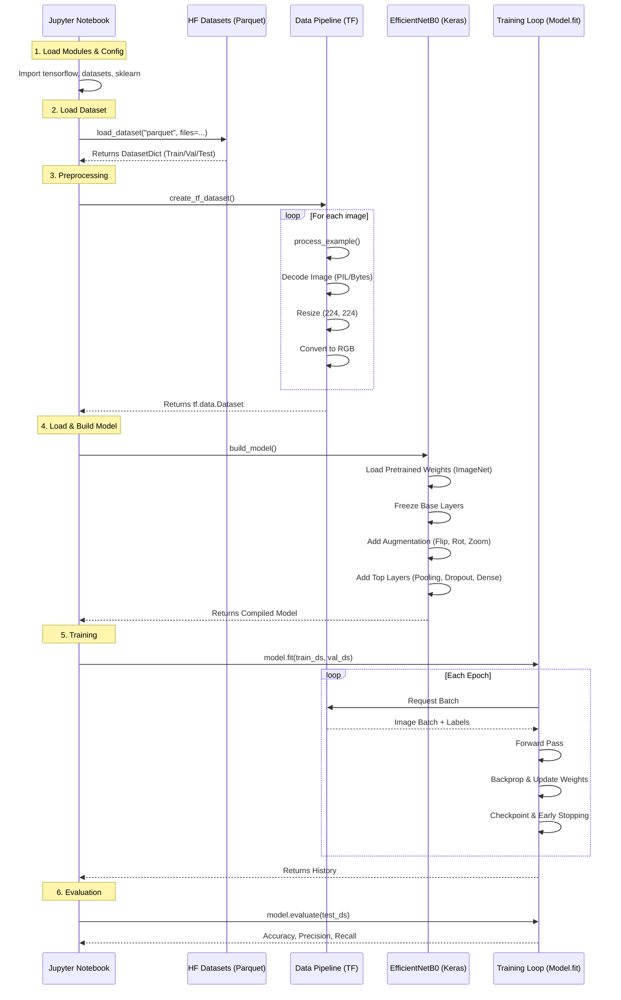
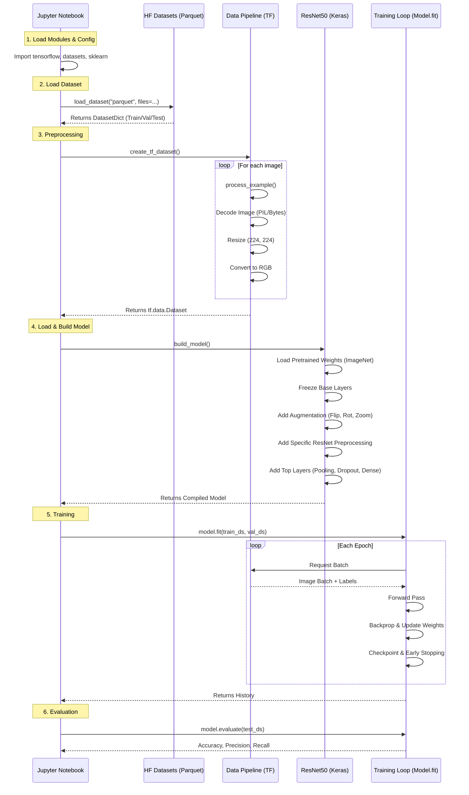

# Project UML Diagrams

These diagrams represent the end-to-end workflow implemented in the Jupyter Notebooks for `EfficientNet` and `ResNet` models.

## 1. EfficientNet Workflow

## 2. ResNet-50 Workflow

